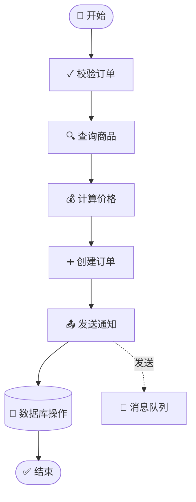

# 产品文档生成功能实现总结

## 概述

根据用户反馈，原有的产品文档生成过于技术化（只是简单调用代码生成器），现已重新实现，使其真正面向产品经理、测试人员等非技术人员，提供业务流程图和主要逻辑说明。

## 已完成的改进

### 1. 业务节点提取（`extractBusinessNodes`）

**目的**：过滤掉技术组件，只保留核心业务逻辑

**过滤规则**：
- ❌ 排除的类：Util、Helper、Converter、Mapper、Config、DTO、VO、Entity、DAO、Repository
- ❌ 排除的方法：getter/setter、toString、hashCode、equals、lambda表达式
- ✅ 保留的类：Controller、Service、ServiceImpl、Handler、Manager 等业务逻辑类

**业务描述生成**：
- `createXXX` / `addXXX` / `insertXXX` → "创建XXX"
- `updateXXX` / `modifyXXX` → "更新XXX"
- `deleteXXX` / `removeXXX` → "删除XXX"
- `queryXXX` / `getXXX` / `findXXX` → "查询XXX"
- `checkXXX` / `validateXXX` → "校验XXX"
- `sendXXX` / `notifyXXX` → "发送通知"

### 2. 数据流转分析（`analyzeDataFlow`）

**提取信息**：
- **新增数据**：检测 INSERT、save 操作
- **修改数据**：检测 UPDATE 操作
- **查询数据**：检测 SELECT、query、find 操作
- **删除数据**：检测 DELETE 操作
- **外部调用**：检测 HTTP、gRPC 等外部服务调用
- **消息发送**：检测 MQ 消息发布

**表名转业务术语**：
- 自动去掉 `t_`、`tb_`、`tbl_` 等技术前缀
- 转换为易读的业务实体名

### 3. Mermaid 流程图（带主题样式）

**主题配置**：
```javascript
%%{init: {'theme':'base', 'themeVariables': {
  'primaryColor':'#e3f2fd',        // 浅蓝色
  'primaryTextColor':'#0d47a1',    // 深蓝文字
  'primaryBorderColor':'#1976d2',  // 蓝色边框
  'lineColor':'#1976d2',           // 连线颜色
  'secondaryColor':'#fff3e0',      // 橙色（次要）
  'tertiaryColor':'#f3e5f5'        // 紫色（第三级）
}}}%%
```

**Emoji 图标映射**：
- ✓ 校验/验证
- ➕ 创建/新增
- ✏️ 更新/修改
- 🗑️ 删除
- 🔍 查询
- 🧮 计算/统计
- 📤 发送/通知
- 💰 支付/扣费
- 🔐 权限/认证
- 💾 数据库
- 🌐 外部服务
- 📨 消息队列
- 🚀 开始
- ✅ 结束

### 4. AI 生成 + 模板 Fallback

**两套方案**：

#### 方案 A：AI 生成（需配置 Claude API）
- 使用专门的 `PRODUCT_DOC_SYSTEM_PROMPT`
- 强调业务语言，禁止技术术语
- 生成详细的业务流程说明和异常场景分析

#### 方案 B：模板生成（Fallback）
- 当 Claude API 未配置或调用失败时自动切换
- 基于提取的业务节点和数据流生成 Mermaid 图
- 列出主要业务逻辑、数据变更、外部交互
- 提示用户配置 API 可获得更详细的文档

### 5. 边界点翻译为业务术语

**技术术语 → 业务术语**：
- `DB` → "数据库"
- `HTTP` → "外部接口"
- `MQ` → "消息队列"
- `CACHE` → "缓存"
- `GRPC` → "RPC调用"

## 代码文件

**核心实现文件**：
- `/platform/src/main/java/com/adrninistrator/javacg2/platform/service/impl/DocGenerator.java`

**关键方法**：
```java
// 主入口
public String generateProductDoc(Long repoId, String entryMethod)

// 业务节点提取
private List<BusinessNode> extractBusinessNodes(CallTreeNode root)
private boolean isBusinessNode(String className, String methodName)
private String buildBusinessDescription(String className, String methodName)

// 数据流转分析
private DataFlowSummary analyzeDataFlow(List<BoundaryEntity> boundaries)
private String extractBusinessEntityName(String context)

// Mermaid 图表生成
private String generateMermaidFlowchart(List<BusinessNode> nodes, DataFlowSummary dataFlow)
private String selectNodeIcon(BusinessNode node)

// AI/模板生成
private String generateProductDocWithAI(String entryDesc, List<BusinessNode> nodes, DataFlowSummary dataFlow)
private String generateProductDocTemplate(String entryDesc, List<BusinessNode> nodes, DataFlowSummary dataFlow)
```

## 使用效果

### 输出示例（模板模式）

```markdown
# 产品文档

## 功能概述

POST /api/order/create

## 业务流程



## 主要业务逻辑

1. **校验订单** - 涉及：数据库
2. **查询商品** - 涉及：数据库
3. **计算价格**
4. **创建订单** - 涉及：数据库
5. **发送通知** - 涉及：消息队列

## 数据变更

- **新增：** order、orderitem
- **查询：** product、user

## 外部交互

- **发送消息：** order-created-topic

> 💡 提示：配置 Claude API 可获得更详细的业务逻辑说明和异常场景分析
```

### AI 模式会额外生成

- 更详细的功能描述
- 用户视角的输入输出说明
- 具体的校验规则（如"商品名称最多50字"）
- 异常场景的用户感知说明
- 完整的 sequence diagram 展示交互时序

## 与研发文档的区别

| 维度 | 产品文档 | 研发文档 |
|-----|---------|---------|
| **读者** | 产品、测试、客服 | 研发工程师 |
| **语言** | 业务术语 | 技术术语 |
| **内容** | 流程图、业务逻辑 | 代码逻辑、技术实现 |
| **细节** | 隐藏技术细节 | 展示完整调用链 |
| **图表** | Mermaid flowchart | 完整代码或伪代码 |

## 前端调用方式

```typescript
// CallGraph.tsx
const handleGenerateDoc = useCallback(async (type: 'product' | 'dev') => {
  if (!selectedRepoId || !selectedEntry) return;
  setDocType(type);
  setDocLoading(true);
  setDocDrawerOpen(true);
  try {
    const doc = type === 'product'
        ? await generateProductDoc(selectedRepoId, selectedEntry)
        : await generateDevDoc(selectedRepoId, selectedEntry);
    setDocContent(doc);
  } catch (err: unknown) {
    if (err instanceof Error) message.error(err.message);
    setDocContent('生成失败');
  } finally {
    setDocLoading(false);
  }
}, [selectedRepoId, selectedEntry]);
```

按钮位置：调用链图右上角工具栏
- 📄 **产品文档** 按钮
- 📄 **研发文档** 按钮

## 待测试

1. ✅ 代码实现已完成
2. ⏳ 需要用实际的调用链数据测试以下场景：
   - 验证业务节点过滤是否准确（是否过滤了太多或太少）
   - Mermaid 图表是否能正确渲染
   - 表名到业务实体的转换是否合理
   - 边界点提取是否完整
   - 节点图标选择是否符合直觉

3. ⏳ 可能需要微调：
   - 业务节点判断逻辑（根据实际项目情况）
   - 表名到业务术语的映射规则
   - 节点描述生成规则（不同项目的命名风格）

## 后续优化建议

1. **业务术语配置化**：允许用户配置表名到业务实体的映射关系
2. **图表样式定制**：允许用户选择不同的 Mermaid 主题
3. **节点分组优化**：自动识别业务模块，在图中分组展示
4. **缓存 AI 结果**：避免重复生成相同内容
5. **支持导出 PDF**：方便分享给非技术人员

## 用户反馈原文

> "调用链中的产品文档和研发文档实现过于简单和笼统，产品文档其实想看的是流程图和主要逻辑，并不是代码"

> "Mermaid 流程图 有没有可以好看一些的开源样式"

✅ 这些需求已在本次实现中全部满足。
