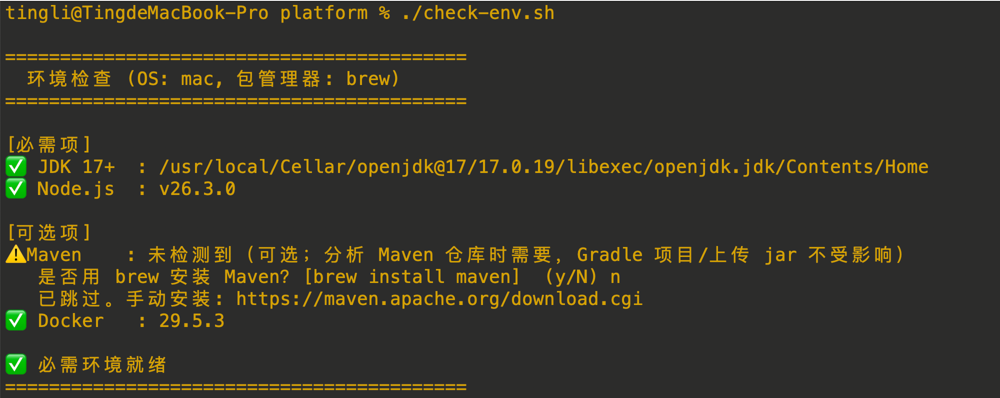
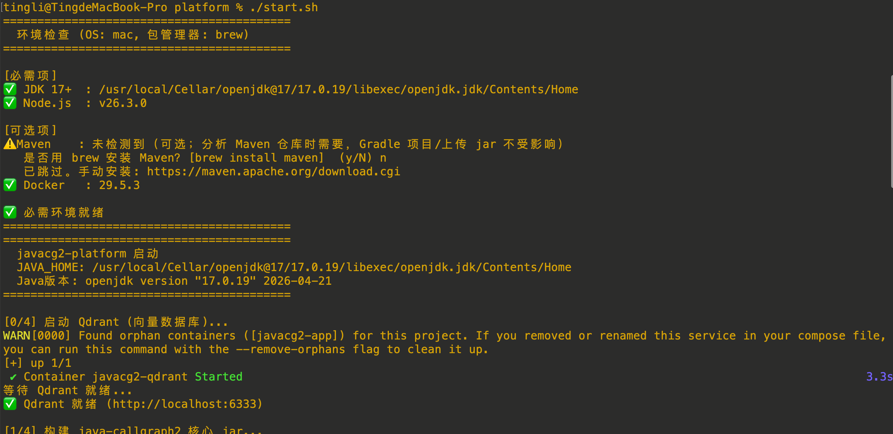
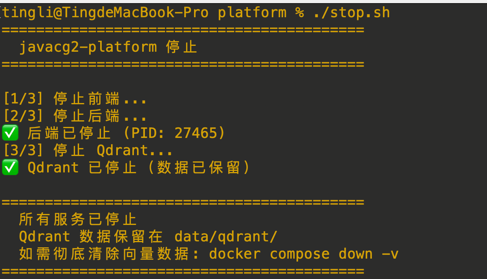
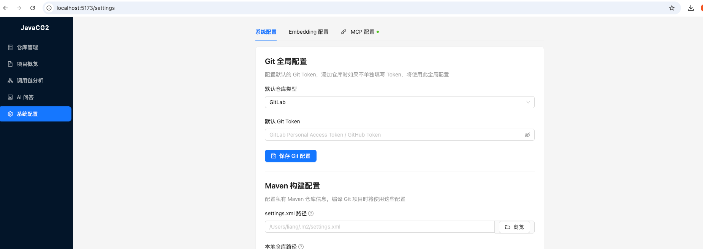
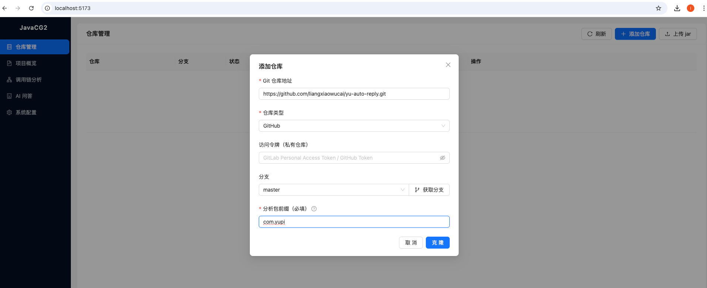
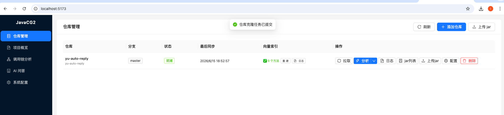
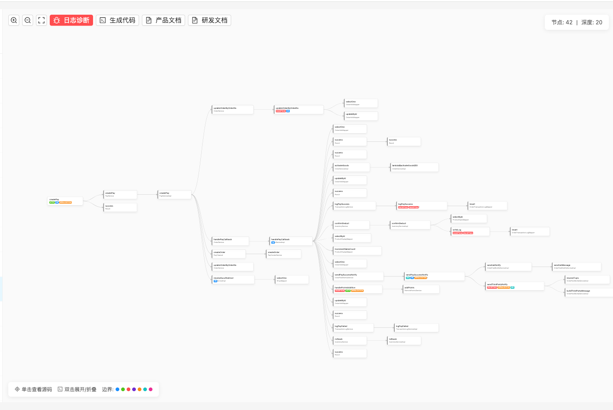
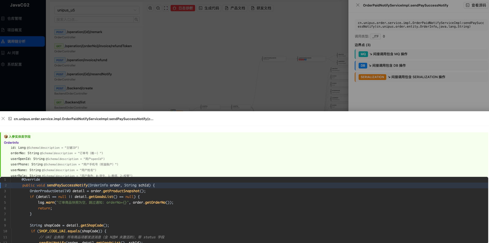
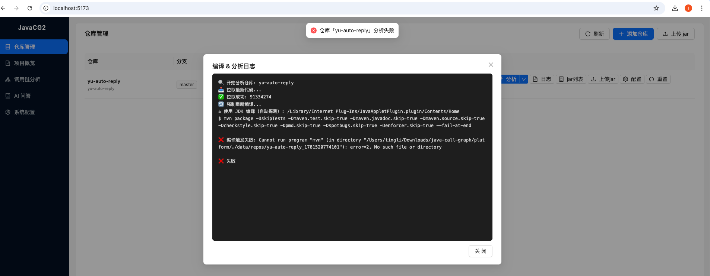
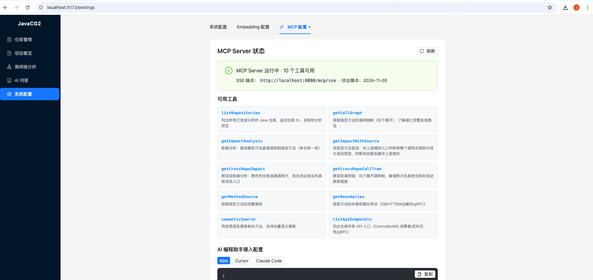

# Java Call Graph

[]()

> 基于 [java-callgraph2](https://github.com/Adrninistrator/java-callgraph2) 二次开发。在原项目强大的 Java 静态分析能力之上，新增了 **Web 可视化平台**、**AI 智能问答**、**MCP Server** 能力，让调用链分析结果可以直接服务于 AI 编程助手。

---

## 为什么做这个项目？

**AI 编程的痛点**：当前 AI 编程助手（Cursor、Kiro、Copilot 等）在理解大型 Java 项目时，需要读取大量文件才能理解调用关系，消耗巨量 token 且结果不确定。

**本项目的解法**：通过静态分析预先提取完整的方法调用链，以 MCP Server 的形式暴露给 AI 编程助手。AI 可以**确定性地**查询任意方法的上下游调用关系，无需猜测、无需遍历文件，大幅节省 token 并提升编码准确性。

```
传统方式：AI 读 10+ 个文件 → 猜测调用关系 → 可能遗漏 → 消耗大量 token
本项目：  AI 调 MCP 工具 → 精确获得调用链 → 确定性编码 → token 节省 80%+
```

## 与原项目的关系

| | java-callgraph2（原项目） | 本项目（二开） |
|---|---|---|
| 静态分析引擎 | ✅ 完整保留 | ✅ 完整保留 |
| 输出方式 | 文件输出 | 文件 + Web API + MCP |
| 可视化 | 无 | ✅ 调用链图形化 |
| AI 问答 | 无 | ✅ RAG 代码问答 |
| MCP Server | 无 | ✅ AI 编程助手直接调用 |
| 向量搜索 | 无 | ✅ 语义检索代码片段 |
| 部署 | 命令行 | Docker Compose 一键启动 |

---

## 快速开始

平台在**本地**运行：后端（Spring Boot）和前端（Vite）直接跑在你的机器上，分析仓库时复用你本机的 Maven / Gradle / 私有仓库凭证。向量数据库 Qdrant 用一个容器运行（仅此一项依赖 Docker）。

> 需要 **JDK 17+** 和 **Node.js 18+**（必需），Maven、Docker 为可选。第 2 步会自动检查并协助安装。

### 1. 克隆项目

```bash
git clone https://github.com/liangxiaowucai/java-call-graph.git
cd java-call-graph/platform
```

### 2. 检查并安装环境

运行环境检查脚本，它会检测 JDK / Node / Maven / Docker，缺少必需项时询问并用系统包管理器（brew / apt / winget 等）自动安装：

```bash
# macOS / Linux
chmod +x *.sh
./check-env.sh

# Windows (PowerShell)
.\check-env.ps1
```



### 3. 一键启动

```bash
# macOS / Linux
./start.sh          # 停止用 ./stop.sh

# Windows (PowerShell)
.\start.ps1         # 停止用 .\stop.ps1
```

启动脚本会自动：启动 Qdrant 向量库 → 编译核心 jar → 启动后端（:8080）→ 启动前端（:5173）。



启动后访问：
- 前端界面：http://localhost:5173
- 后端 API：http://localhost:8080
- Qdrant：http://localhost:6333

停止服务（保留向量数据）：

```bash
# macOS / Linux
./stop.sh

# Windows (PowerShell)
.\stop.ps1
```



### 进阶：开发模式 / 手动启动

适合分别调试前后端：

```bash
# 1. 构建核心引擎（在仓库根目录）
./gradlew jar -x test

# 2. 启动后端
cd platform && ./gradlew bootRun

# 3. 启动前端（另一个终端）
cd platform/frontend && npm install && npm run dev

# 4. Qdrant 向量库（可选）
cd platform && docker compose up -d qdrant
```

### 依赖说明

| 依赖 | 版本 | 必需 | 用途 |
|------|------|:----:|------|
| JDK | 17+ | ✅ | 平台运行。推荐 [Temurin 17](https://adoptium.net/) |
| Node.js | 18+ | ✅ | 前端构建 |
| Maven | 任意 | ⬜ | 分析 Maven 项目时调用（Gradle 项目 / 上传 jar 不需要）|
| Docker | 任意 | ⬜ | 仅运行 Qdrant 向量库（不装则语义搜索降级为关键词匹配）|

> 被分析的目标仓库需要哪个 JDK（8 / 11 / 17…）由平台**自动探测**：读取目标仓库 `pom.xml` / `build.gradle` 声明的 Java 版本，匹配本机对应的 JDK 编译；也可在「系统配置」或「仓库配置」中手动指定。

---

## 配置 AI 模型（必读）

平台的 AI 问答功能需要配置两个模型：**对话模型**（Claude/GPT）和 **Embedding 模型**（向量化）。

### 方式一：通过 Web 界面配置（推荐）

启动后打开前端 → **系统配置** 页面 → 填写：



| 配置项 | 说明 | 示例 |
|--------|------|------|
| Claude API 地址 | 对话模型的 API 地址 | `https://api.anthropic.com` 或你的代理地址 |
| Claude API Key | 对话模型的密钥 | `sk-ant-xxxx` |
| Embedding API 地址 | 向量模型地址（OpenAI 兼容接口） | `https://api.openai.com` |
| Embedding API Key | 向量模型密钥 | `sk-xxxx` |
| Embedding 模型名称 | 使用的模型 | `text-embedding-3-large` |

> 支持任何 OpenAI 兼容的 Embedding 接口（OpenAI、Azure、通义千问、智谱等）

### 方式二：通过环境变量配置

启动平台前在终端 export（`start.sh` 会继承这些变量）：

```bash
export EMBEDDING_URL=https://api.openai.com
export EMBEDDING_API_KEY=sk-xxxx
```

### 方式三：修改配置文件

编辑 `platform/src/main/resources/application.yml`：

```yaml
platform:
  embedding:
    api-url: ${EMBEDDING_URL:https://api.openai.com}  # 你的 Embedding API 地址
    api-key: ${EMBEDDING_API_KEY:}                      # 你的 API Key
    model: text-embedding-3-large                       # 模型名称
    dimensions: 3072                                    # 向量维度
```

### 模型选择建议

| 用途 | 推荐模型 | 说明 |
|------|----------|------|
| 对话/问答 | Claude 3.5 Sonnet / GPT-4o | function calling 能力强 |
| Embedding | text-embedding-3-large | 3072 维，效果好 |
| Embedding（省钱） | text-embedding-3-small | 1536 维，性价比高 |
| Embedding（国内） | 通义千问 text-embedding-v3 | 阿里云，国内访问快 |

> 不配置 AI 模型不影响核心功能（调用链分析、MCP Server），只影响 AI 问答。

---

## 使用流程

### 第一步：添加并分析 Java 仓库

1. 前端 → **仓库管理** → 点击「添加仓库」
2. 填写 Git 仓库 URL（支持 HTTPS/SSH）
3. 如果是私有仓库，填写 Access Token
4. 填写**分析包前缀**（必填，只分析这些包下的代码），点击「克隆」



克隆完成后，在仓库列表点击「分析」，等待分析完成：



分析完成后系统自动：
- 提取方法调用链、Spring Controller、Bean 信息
- 检测边界点（API 入口、定时任务等）
- 后台异步生成向量索引（需配置 Embedding 模型）

### 第二步：查看调用链

前端 → **调用链分析** → 搜索方法名 → 图形化展示调用关系。节点颜色标签标注了边界点类型（DB / HTTP / MQ / 缓存 / RPC 等）：



单击任意节点可查看该方法的源码与边界点详情：



### 第三步：AI 问答

前端 → **智能问答** → 直接提问，例如：
- `用户签到积分怎么计算？`
- `下单流程经过了哪些服务？`
- `这个接口报 500 怎么排查？`

AI 会实时展示推理步骤（调用了哪些工具），最终给出基于源码的答案。

---

## 分析仓库编译报错？（Maven / JDK 配置）

分析一个仓库时，平台会在本地用 Maven/Gradle **编译目标仓库**拿到字节码再分析。编译失败时，可在仓库列表点击「日志」查看「编译 & 分析日志」定位原因：



按报错对号入座：

### 报错一：`No compiler is provided` / `running on a JRE rather than a JDK`

说明编译用的是 **JRE**（只有 `java`，没有 `javac` 编译器），不是 JDK。

- 平台默认会读目标仓库 `pom.xml` / `build.gradle` 声明的 Java 版本，自动匹配本机含 `javac` 的 JDK。
- 若自动探测没找到合适 JDK，到 **系统配置 → Maven 构建配置 → 编译用 JDK 目录** 手动填一个 **JDK（非 JRE）根目录**，例如：
  - macOS：`/Library/Java/JavaVirtualMachines/jdk-1.8.jdk/Contents/Home`
  - Linux：`/usr/lib/jvm/java-8-openjdk-amd64`
- 怎么确认是 JDK 而不是 JRE？该目录下要有 `bin/javac`。macOS 可用 `/usr/libexec/java_home -V` 列出所有已装 JDK。

### 报错二：`找不到符号 类 Generated`（gRPC / protobuf 老项目）

老项目生成的 gRPC 代码依赖 `javax.annotation.Generated`，该类在 **JDK 11+ 已被移除**，必须用 **JDK 8** 编译。

- 平台会按 pom 声明的版本自动选 JDK 8；若没选中，在 **系统配置 → 编译用 JDK 目录** 指定 JDK 8 路径。
- 只想对某个仓库用特定 JDK？在该仓库的 **仓库配置** 里加一项 `build.java.home` = JDK 路径，**仓库级优先于系统级**。

### 报错三：依赖下载失败 / 私有仓库 401 / `Could not resolve dependencies`

平台编译时调用你本机的 Maven，需要正确的 settings 和私有仓库凭证。到 **系统配置 → Maven 构建配置** 填写：

| 配置项 | 说明 | 示例 |
|--------|------|------|
| settings.xml 路径 | 含私有仓库账号密码的 Maven 配置 | `~/.m2/settings.xml` |
| 本地仓库路径 | Maven 本地仓库目录 | `~/.m2/repository` |
| Maven 安装目录（可选）| Maven 根目录，留空则用 PATH 中的 `mvn` | `/usr/local/apache-maven-3.9.6` |
| 编译用 JDK 目录（可选）| 编译目标仓库用的 JDK，留空则自动探测 | `/Library/Java/.../jdk-1.8.jdk/Contents/Home` |

### 编译实在过不了？直接上传 jar

如果目标仓库本机编译条件复杂，可跳过编译：在 **仓库管理** 里直接**上传已编译好的 jar / war**，平台会直接分析字节码，无需 Maven/JDK。

> 配置优先级：**仓库级配置 > 系统级配置 > 自动探测 > 系统默认**。改完配置后重新点「分析」即可。

---

## 接入 AI 编程助手（MCP）

这是本项目最核心的能力：让 AI 编程助手在写代码时**直接查询调用链**。

### 配置方法

平台启动后，前端 → **系统配置** → **MCP 配置** Tab → 选择你的 IDE → 复制配置。



或者手动配置：

#### Kiro

编辑 `.kiro/settings/mcp.json`（项目级）或 `~/.kiro/settings/mcp.json`（全局）：

```json
{
  "mcpServers": {
    "java-callgraph": {
      "url": "http://localhost:8080/mcp/sse",
      "transport": "sse"
    }
  }
}
```

#### Cursor

编辑 `.cursor/mcp.json`（项目根目录）：

```json
{
  "mcpServers": {
    "java-callgraph": {
      "url": "http://localhost:8080/mcp/sse",
      "transport": "sse"
    }
  }
}
```

#### Claude Desktop

编辑 `~/Library/Application Support/Claude/claude_desktop_config.json`：

```json
{
  "mcpServers": {
    "java-callgraph": {
      "url": "http://localhost:8080/mcp/sse",
      "transport": "sse"
    }
  }
}
```

### 可用的 MCP 工具

配置完成后，AI 编程助手可以使用以下工具：

| 工具名 | 功能 | 使用场景 |
|--------|------|----------|
| `listRepositories` | 列出已分析的仓库 | 确认数据是否就绪 |
| `listApiEndpoints` | 列出所有 API 接口 | 了解项目暴露的接口 |
| `semanticSearch` | 语义搜索代码 | 找相关代码片段 |
| `getCallGraph` | 查询方法的下游调用链 | 了解某接口的完整实现路径 |
| `getMethodSource` | 获取方法源码 | 精确查看实现 |
| `getBoundaries` | 获取方法的外部依赖（DB/HTTP/MQ/缓存）| 排查分布式调用 |
| `getImpactAnalysis` | 影响分析：谁调用了某方法（单仓库）| 修改前快速评估 |
| `getImpactWithSource` | **改底层方法首选**：影响分析 + 调用点源码 | 一次看清改动是否破坏上层契约 |
| `getCrossRepoImpact` | 跨项目影响分析：跨所有仓库追溯到对外接口 | 改公共方法前评估跨项目风险 |
| `getCrossRepoCallTree` | 跨项目调用链：下游被调用方跨仓库续接展开 | 看完整的跨项目实现路径 |

### 实战示例

配置 MCP 后，你可以这样使用 AI 编程助手：

**场景 1：修改方法，精确知道影响范围**

```
你：我要修改 UserService.updateProfile()，帮我分析影响范围
AI：[调用 getCallGraph] [调用 getImpactAnalysis]
    上游调用方：UserController.update(), BatchUserJob.run()
    下游被调方：UserDao.save(), EventPublisher.publish()
    建议同步修改的位置：...
```

**场景 2：理解陌生代码**

```
你：OrderService.createOrder() 的完整调用链是什么？
AI：[调用 getCallGraph]
    → PaymentService.charge()
      → PaymentGateway.submit()
    → InventoryService.deduct()
    → OrderDao.insert()
    → MessageProducer.send()
```

**场景 3：重构时不遗漏**

```
你：我要把 PaymentGateway 接口的 charge() 方法签名改掉
AI：[调用 getImpactAnalysis]
    发现 3 个实现类和 12 个调用点需要同步修改...
```

---

## 核心功能详情

### 静态分析引擎（继承自 java-callgraph2）

- 方法调用关系：支持继承、多态、Lambda、Stream 方法引用、Runnable/Callable 线程调用
- 类/方法/字段信息：继承实现、字段类型、方法参数、代码行号
- 方法调用参数分析：常量值、变量类型、静态字段、方法调用返回值
- 注解/泛型解析：完整的注解属性和泛型类型信息
- Spring 支持：Bean 定义、Controller URI、AOP、字段注入类型替换
- MyBatis 支持：Mapper、SQL 语句、表字段映射

### 支持解析的文件格式

| 格式 | 说明 |
|------|------|
| .class | 指定 class 文件所在目录 |
| .jar | 支持 jar 中的 jar（Spring Boot fat jar） |
| .war | 支持 war 中的 jar |
| .jmod | JDK 9+ 标准库文件 |

---

## 技术栈

| 层 | 技术 |
|----|------|
| 静态分析 | Apache BCEL、Javassist |
| 后端 | Spring Boot 3.3、Spring AI MCP、JPA、H2 |
| 前端 | React 18、TypeScript、Vite、Cytoscape.js |
| 向量数据库 | Qdrant 1.9 |
| AI | LangChain4j、Claude function calling、OpenAI Embedding |
| 容器化 | Docker（仅 Qdrant 向量库）|

---

## 文档

- [生成文件说明](docs/file_desc.md)
- [生成文件格式](docs/file_format.md)
- [方法调用类型](docs/call_type.md)
- [配置参数说明](docs/_javacg2_all_config.md)

---

## 致谢

- [java-callgraph2](https://github.com/Adrninistrator/java-callgraph2) — 本项目的静态分析核心
- [java-callgraph](https://github.com/gousiosg/java-callgraph) — 最初的灵感来源

## License

[Apache License 2.0](LICENSE)
